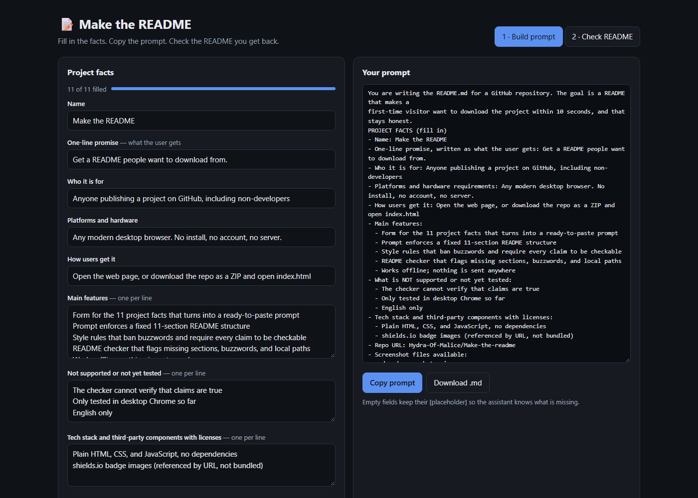
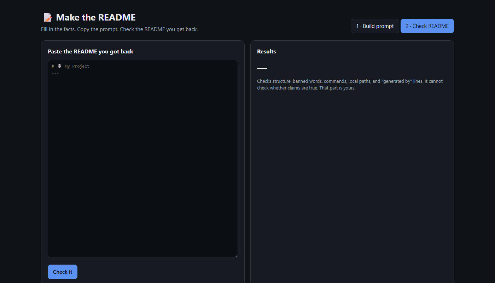

<div align="center">

# 📝 Make the README

### Get a README people want to download from.

**Fill in 11 facts · Get a ready-to-paste prompt · Check the result**

[](https://github.com/Hydra-Of-Malice/Make-the-readme/archive/refs/heads/main.zip)




</div>

Make the README turns a few plain facts about your project into a detailed prompt you paste into any AI chat assistant. The README you get back follows a fixed, proven layout: a strong first screen, clear download steps, and an honest list of limits. Use it for a new open-source tool, a desktop app release, a class project, or to clean up an old repo.

## 💡 Why you'll like it

| | |
|---|---|
| ⚡ **Done in minutes** | You answer 11 short questions and copy one block of text. |
| 🎯 **First screen that sells** | The prompt asks for a title, tagline, badges, and screenshot above the fold. |
| 🧾 **Honest by design** | Every claim must be checkable, and limits must be listed, not hidden. |
| 🚫 **No buzzwords** | Words like "revolutionary" and "seamless" are banned in the prompt and flagged by the checker. |
| ✅ **Built-in check** | Paste the README back in and see what is missing or off. |
| 🔒 **Private** | Everything runs in your browser. Nothing you type leaves your computer. |
| 🆓 **Free and open** | MIT licensed. Copy the prompt, change it, share it. |

## 🚀 Three steps



1. **Fill in the facts.** Name, promise, audience, features, limits, and a few more.
2. **Paste the prompt.** Copy it into your AI chat assistant and ask for the README.
3. **Check the result.** Paste the README into the Check tab, fix what it flags, and commit.

## 📥 Download

1. Download the [ZIP of this repo](https://github.com/Hydra-Of-Malice/Make-the-readme/archive/refs/heads/main.zip).
2. Unzip it anywhere.
3. Double-click `index.html`. It opens in your browser. No install needed.

Prefer the raw prompt? Copy [`prompt/readme-prompt.md`](prompt/readme-prompt.md) and fill in the brackets by hand.

| Requirement | Details |
|---|---|
| Browser | A current desktop browser. Tested in Chrome. |
| Internet | Not needed to build or check. Needed only to use an online AI assistant. |
| AI assistant | Any chat assistant you already use. Not included. |
| Not supported | Mobile layout is usable but not tested. Languages other than English. |

## 🔍 What it does

| Stage | What happens |
|---|---|
| Build | Your 11 facts are inserted into the prompt. Empty fields keep a `[placeholder]` so the assistant knows what is missing. |
| Save | Your answers are kept in your browser's local storage, so they are still there when you come back. |
| Export | Copy the prompt to the clipboard or download it as a `.md` file. |
| Check | The pasted README is scanned for the hero block, required sections, section order, step count, table size, buzzwords, untagged code blocks, local paths, and "generated by" lines. |

## ⚙️ How it works

```text
 your facts ──► prompt builder ──► prompt (.md) ──► your AI assistant
                                                          │
 fixes ◄── README checker ◄── README.md ◄─────────────────┘
```

| Component | Purpose | License |
|---|---|---|
| `index.html` | Form, prompt builder, and README checker in one file | MIT |
| `prompt/readme-prompt.md` | The prompt template on its own | MIT |
| shields.io | Badge images in the generated README, loaded by URL | See [notices](THIRD_PARTY_NOTICES.md) |

## ⚠️ Known limits

- The checker tests structure and wording. It cannot tell whether a claim is true. You must check that yourself.
- The checker uses simple text matching. Unusual heading names may be reported as missing.
- Output quality depends on the AI assistant you paste the prompt into.
- Tested only in desktop Chrome. Other browsers should work but are not tested.
- The prompt and interface are in English only.
- Saved answers live in one browser on one computer. Clearing site data removes them.

## 🛠️ Development

Prerequisites: Git and a browser. There is no build step and no dependencies.

```bash
git clone https://github.com/Hydra-Of-Malice/Make-the-readme.git
cd Make-the-readme
```

Open `index.html` in your browser and edit it. Reload to see changes.

| Folder / file | Contents |
|---|---|
| `index.html` | The whole app: HTML, CSS, and JavaScript |
| `prompt/` | The prompt template as plain Markdown |
| `docs/` | Screenshots used in this README |
| `THIRD_PARTY_NOTICES.md` | Third-party notices |

The prompt text appears twice: in `prompt/readme-prompt.md` and in the `TEMPLATE` constant in `index.html`. Change both together.

To publish the page online, enable GitHub Pages for the `main` branch in the repo settings.

## 📄 License

[MIT](LICENSE). See [third-party notices](THIRD_PARTY_NOTICES.md).
